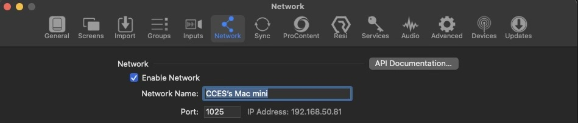

# ProPresenter Slide Clicker 🖱️

This project is a simple web-based application designed to act as a remote viewer and clicker for ProPresenter presentations. It allows users to view the current and next slides, including their text content, notes, and thumbnails, and navigate through the presentation using "Previous" and "Next" buttons. The application connects to a ProPresenter instance via its API.

## Features ✨

-   **Current and Next Slide Display:**  Shows the text content and notes for both the currently active slide and the upcoming slide.
    
-   **Slide Thumbnails:**  Displays a visual thumbnail of the current and next slides for better context. 🖼️
    
-   **Navigation Controls:**  "Previous" and "Next" buttons to advance or go back in the presentation. ◀️ ▶️
    
-   **ProPresenter API Connection:**  Configurable IP address and port to connect to your ProPresenter instance. 🔌
    
-   **Real-time Updates:**  Automatically refreshes slide information every 10 seconds to keep the display current. 🔄
    
-   **Error Handling:**  Provides visual feedback for connection issues or API errors. ⚠️
    
-   **Responsive Design:**  Adapts to different screen sizes, making it usable on both desktop and mobile devices. 📱💻
    

## How to Use 🚀

1.  **Network Requirements:**  🌐
    
    -   This application is designed to work within a  **local network**  environment.
        
    -   It communicates directly with the ProPresenter API using HTTP.
        
    -   Therefore, the ProPresenter machine and the device running this web application must be on the  **same local network**, and you should use the  **local IP address**  of the ProPresenter machine.
        
2.  **Host the Application:**  📁
    
    -   Save the provided HTML code as an  `index.html`  file.
        
    -   For basic use, you can open  `standalone.html`  directly in a web browser on a computer within the same local network as ProPresenter.
        
    -   For mobile device access or more robust hosting, you will need to host the application on a local web server (see "Deployment with Docker" below).
        
3.  **Configure ProPresenter API:**  ⚙️
    
    -   Ensure your ProPresenter instance has its API enabled and is accessible from the device running this web application.
        
    -   The default API port for ProPresenter is often  `1025`.
        
    
4.  **Enter ProPresenter IP and Port:**  🔢
    
    -   Upon loading the page, you will see input fields for "IP" and "PORT" at the bottom of the screen.
        
    -   Enter the  **local IP address**  of the computer running ProPresenter and the port number for its API.
        
    -   Click the "Submit" button to save the configuration. The application will then attempt to connect and fetch data.
        
    -   The entered IP and Port will be saved in your browser's local storage for future use.
        
    -   **Tip:**  It is highly recommended to set a fixed IP address for the device running ProPresenter to avoid constantly needing to update the IP in the application. 📌
        
5.  **Navigate Slides:**  ➡️
    
    -   Use the "Previous" and "Next" buttons to control the ProPresenter presentation.
        
    -   The "Current Slide" and "Next Slide" sections will update automatically.
        

## Deployment with Docker 🐳

For easier hosting, especially if you need to access the application from mobile devices, a Docker setup is provided.

1.  **Build and Run:**  🏗️
    
    -   **Navigate to the root of your project folder**  (where your  `index.html`  and  `Dockerfile`  are located).
        
    -   Run the following command to build and start the Docker container:
        
        ```
        docker compose up --build
        
        ```
        
    -   By default, the application will be accessible at  `http://localhost:8080`.
        
2.  **Access from Mobile Devices:**  📲
    
    -   Once the Docker container is running, you can access the application from mobile devices on the same local network by navigating to  `http://[IP_OF_HOST_PC]:8080`  in your mobile browser. Replace  `[IP_OF_HOST_PC]`  with the actual local IP address of the computer running the Docker container.
        
3.  **Shut Down:**  🛑
    
    -   To stop and remove the Docker containers, use:
        
        ```
        docker compose down
        
        ```
        

## Technologies Used 🛠️

-   **HTML5:**  For the structure of the web page.
    
-   **Tailwind CSS:**  For rapid and responsive styling.
    
-   **JavaScript:**  For all interactive functionality, API calls, and DOM manipulation.
    
-   **ProPresenter API:**  The backend API that this application interacts with to get slide data and control the presentation.
    
-   **Docker:**  For containerized deployment.
    

## Development Notes 📝

-   The application uses  `localStorage`  to persist the ProPresenter API base URL.
    
-   Error messages are displayed temporarily for user feedback.
    
-   Spinning loaders are shown while fetching slide thumbnails.
    
-   The application polls the ProPresenter API every 10 seconds to keep the slide status updated.